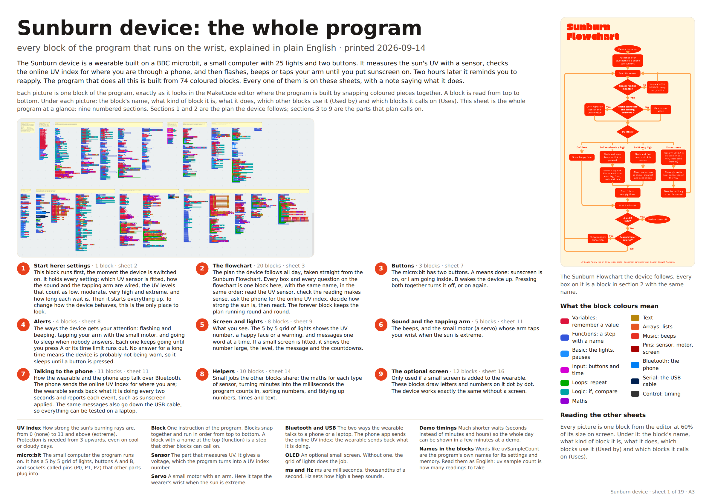

# Sunburn device — micro:bit firmware 3.1

A UV wearable for the BBC micro:bit that follows the **Sunburn Flowchart**: it reads a UV sensor, combines it with the online UV index sent by a phone over Bluetooth, and then flashes, beeps or taps your arm until you put sunscreen on. Two hours later it reminds you to reapply. A companion web app at **https://justadev742.github.io/Trashbin-robot/** supplies the live UV index for your location over Bluetooth and shows the device's status and history (section 6).

The whole program is real MakeCode blocks (no grey JavaScript blocks), laid out in nine numbered sections that follow the flowchart box by box. The **code poster** in `docs/poster/` shows every block of it at readable size with a label saying what it does (section 1).


## 1. Load it

**From the project file**

1. Open [makecode.microbit.org](https://makecode.microbit.org).
2. On the home page click **Import**, then **Import File…**, and choose `sunburn-device.mkcd` (dragging the file onto the editor also works).
3. The project opens in the Blocks view with the Bluetooth extension and the "No Pairing Required" setting already in place.
4. Click **Download** and copy the `.hex` to the micro:bit.

**Straight from GitHub** (works while this repository is public): click **Import**, then **Import URL…**, and paste `https://github.com/JustAdev742/Trashbin-robot`. The `pxt.json`, `main.ts` and `main.blocks` in the root of this repository are the same project.

You need a **micro:bit V2**. Bluetooth plus this program does not fit in a V1's memory; the editor will tell you so if you try (firmware 2.2 had the same limit).

### Reading the Blocks view

Zoom out and you will see nine yellow notes in two rows. Each note is a section heading, and the blocks under it belong to that part of the program:

| Row 1 | Row 2 |
|---|---|
| 1 Start here: settings | 6 Sound and servo |
| 2 The flowchart | 7 Bluetooth and serial |
| 3 Buttons | 8 Helpers |
| 4 Alerts | 9 OLED screen driver (optional) |
| 5 Screen and LEDs | |

Sections 1 and 2 are the whole program. Section 1 is the `on start` block with every setting, and section 2 is the flowchart: `forever` calls `runFlowchart`, and every box and decision on the flowchart is a function with the same name, in the same order (`readUvSensor`, `sensorReadingInRange`, `showCheckSensor`, `phoneSendingOnlineUv`, `chooseUvValue`, `uvBand`, `showHappyFace`, `moderateOrHighUv`, `veryHighUv`, `extremeUv`, `start2HourReapplyTimer`, `wait5Minutes`, `reapplyTimerExpired`, `showReapplySunscreen`, `deviceTurnsOn`, `deviceTurnsOff`). Sections 3 to 9 are the parts those functions call.

Every function block has a comment: click the small **?** icon on a block to read what it does. Do not use **Format code** or **Clean up blocks** from the workspace menu, as that throws the layout away.

### The code poster

The whole program on paper, every block with a note in plain English saying what it does, written for anyone (parents and visitors at an expo included, not only programmers). Three ready-to-print versions live in `docs/poster/`:

| File | Sheets | For | Wall space, roughly |
|---|---|---|---|
| `sunburn-code-poster-A3.pdf` | 19 × A3 | a home or school printer; bind it as a booklet for a table, or pin it up as a grid | 1.5 m × 1.7 m (5 across, 4 down) |
| `sunburn-code-poster-A1.pdf` | 6 × A1 | an expo wall; the same size blocks as A3, so it reads up close | 1.8 m × 1.7 m (3 across, 2 down) |
| `sunburn-code-poster-A0.pdf` | 5 × A0 | a big wall, read from a step back | 2.5 m × 1.7 m, or 3.4 m in a row |

Sheet 1 of every set is landscape: what the device does, how to read the sheets, the whole workspace at a glance, the flowchart, what the block colours mean, an index of the nine sections, and a glossary (UV index, micro:bit, block, sensor, servo, Bluetooth, and how to read names like `uvSampleCount`). The other sheets are portrait and show all 74 blocks photographed from the MakeCode editor, each with its name, what kind of block it is, what it does, which blocks use it and which blocks it calls on. Nothing is left out in any size; the bigger sheets just hold more blocks each.

**Printing:** print at 100% ("actual size", not "fit to page"), single-sided, sheet 1 in landscape and the rest in portrait. Any print shop can do A1 and A0 from the PDF; ask for matte paper so the blocks do not glare under lights. For an expo with little wall space, print sheet 1 alone at A1 or A0 for the wall and put the A3 set on the table as a booklet.



The poster is generated from the project itself, so it must be regenerated after any change to `main.ts` / `sunburn-device.mkcd`:

```
npm i -g playwright && npx playwright install chromium
node tools/poster/make-poster.js                # A3, 19 sheets
node tools/poster/make-poster.js --sheet A1     # 6 sheets; also A2 and A0
node tools/poster/make-poster.js --sheet A0 --zoom 1 --text 2   # bigger blocks and text for reading from further away (more sheets)
```

The script opens the real MakeCode editor in a headless browser, imports `sunburn-device.mkcd`, photographs every top-level block, takes the section list and the plain-English notes from `tools/poster/sections.json`, packs the sheets and prints the PDF. Captures are cached per version of the code, so re-running it for another size or a wording change takes seconds. When you add a function to the program, add it to the right section in `sections.json` with a note in plain English; the script warns about any block it has no place for.

## 2. Wiring

Each pin is used in exactly one function, so it is easy to change:

| Part | Pin | Where in the code |
|---|---|---|
| UV sensor, analog OUT | **P1** | `readUvSensor` (3V and GND to the sensor) |
| Servo signal | **P2** | `servoAngle` (power the servo from 3V or its own battery, GND shared) |
| Buzzer (only if you add one) | P0 | `setupSound`, and set `soundOutput` to 2 |
| OLED SDA / SCL (optional) | P20 / P19 | the I2C pins; `oledCommand` |

Crowtail, ElecFreaks, Kitronik and similar boards route the same pins to plugs: use the plug labelled P1 for the sensor, P2 for the servo and the I2C plug for a screen.

## 3. Settings (section 1, the `on start` block)

| Setting | Meaning |
|---|---|
| `uvSensorType` | 1 = GUVA-S12SD / Crowtail / Grove / DFRobot / ElecFreaks, 2 = ML8511, 3 = sensors sold as "0–1023 = UV 0–15" |
| `uvSampleCount` | samples per reading (the middle value is used, so noise spikes are ignored) |
| `soundOutput` | 1 = micro:bit V2 speaker, 2 = buzzer on P0 |
| `servoType`, `servoRestAngle`, `servoTapAngle` | 1 = positional servo (uses the two angles), 2 = continuous rotation |
| `oledMode`, `oledType`, `oledAddress` | 0 = no screen, 1 = detect at start-up, 2 = always on; 1 = SSD1306, 2 = SH1106; 60 = 0x3C |
| `uvLowMax`, `uvHighMax`, `uvVeryHighMax` | the flowchart bands 0–2, 3–7, 8–10, 11+ (tested on the rounded UV index) |
| `waitMinutes`, `reapplyHours`, `tapMaxMinutes` | the flowchart timings: 5 minutes, 2 hours, 2 minutes |
| `alertGiveUpMinutes` | how long a flash-and-beep alert carries on with no answer before the device assumes it is not being worn and goes to standby |
| `onlineUvMaxAgeMinutes` | how long a value from the phone counts as "the phone is sending online UV" |

Cheap UV sensors are only roughly calibrated. Once it is wired up, look up today's UV index on a weather site, hold the sensor in the sun and send `cal=<that number>` (see section 5 of this file); the scale corrects itself. Send `zero` in the dark first if the reading is not 0 indoors. Do this on the batteries you will actually wear: on 2×AAA the micro:bit's analog reference is about 3.0 V instead of the 3.3 V it has on USB, which shifts every reading by roughly 10%. Calibration lives in RAM, so put the corrected numbers into `applySensorPreset` to make them permanent. The app's **Calibrate sensor to live UV** button does the `cal=` step for you.

## 4. What it does (the flowchart)


| Step | What happens |
|---|---|
| Device turns on | Tick on the LEDs, Bluetooth starts advertising as `BBC micro:bit [name]` |
| Read UV sensor | Median of 15 samples on P1 |
| Sensor reading in range? | No: cross on the LEDs, **CHECK SENSOR**, two beeps, retry in 5 s. A bad sensor is never treated as "safe" |
| Phone connected and sending online UV? | Yes while a `uv=` line arrived in the last 30 minutes: UV = the higher of sensor and online. Otherwise UV = sensor |
| 0–2 low | Happy face |
| 3–7 moderate / high | Flash and slow beep until **A**, then "1 tsp SPF 50+ on each arm, each leg, front, back and face", then the 2 hour timer starts. No **A** within 10 minutes means standby until a button is pressed |
| 8–10 very high | Flash and fast beep until **A**, the same sunscreen advice plus hat and shade, then the 2 hour timer starts |
| 11+ extreme | The servo taps the arm until **A** (after 2 minutes it beeps instead), then "Go inside now. Sunscreen on the way", then standby until any button is pressed. After standby the device reads the sensor straight away instead of waiting 5 minutes |
| Wait 5 minutes | Then back to the top. Press **A** meanwhile to see the UV index and the time until reapply on the LEDs |
| A and B held? | A+B turns the device off at any moment. A+B again turns it on |
| Reapply timer expired? | "Reapply sunscreen", then the next trip round the flowchart alerts again and starts a fresh 2 hours |

One deliberate difference from a literal reading of the chart: the flowchart re-enters the UV branch every 5 minutes, which would beep at you every 5 minutes all afternoon. So the device only alerts when sunscreen is not already on (no reapply timer running), when the band has gone up (moderate/high to very high adds the hat-and-shade advice), or when the timer has expired. While the timer is running it shows a tick and, on the OLED, the time until reapply.

| Buttons | |
|---|---|
| **A** | "Done": sunscreen is on / I am going inside. Also wakes from standby, skips the rest of a message scrolling across the LEDs, and while the device is waiting between checks shows the UV index and the sunscreen countdown |
| **B** | Wakes from standby. Hold B while switching on for **demo mode** (10 s waits, 1 minute sunscreen timer) |
| **A + B** | Device turns off / on. Bluetooth stays up so the app can turn it on again |

Without an OLED, messages scroll across the LEDs one word at a time (press A to skip the rest). With one, the screen shows the UV number large, the band, the current message, and a countdown to the next check and the next sunscreen.

## 5. Bluetooth / serial protocol (for the app or website)

The micro:bit exposes the standard **Nordic UART service** (`6E400001-B5A3-F393-E0A9-E50E24DCCA9E`, RX `…0002`, TX `…0003`). The same lines also go out over USB serial at 115200 baud, so you can test with the MakeCode console or any serial monitor before the app exists.

**Device → app**, every 2 seconds:

```
st=wait;uv=7.3;sen=7.1;onl=6.5;band=vhigh;spf=5400;spfn=3;fw=3.1;demo=0
```

| Field | Meaning |
|---|---|
| `st` | `on` `off` `reading` `error` `safe` `alert` `protected` `wait` `standby` |
| `uv` | UV index used for the decision (the higher of sensor and online) |
| `sen` / `onl` | sensor UV / online UV (`-1` = nothing received in the last 30 minutes) |
| `band` | `low` `modhigh` `vhigh` `extreme` |
| `spf` | seconds until sunscreen reapply is due (`-1` = no timer running) |
| `spfn` | sunscreen applications acknowledged since power-on |
| `fw` / `demo` | firmware version, and `1` while demo timings are on |

**Device → app**, on events: `ev=on` `ev=off` `ev=sunscreen` `ev=reapply` `ev=inside` `ev=standby` `ev=error;msg=CHECK SENSOR` (once per sensor problem, not once per retry). Logging these with a timestamp is all a website needs for daily and monthly statistics.

**App → device**, one command per line (`\n` terminated):

| Command | Effect |
|---|---|
| `uv=6.5` | Push the online UV index (0 to 20; anything else gets `err=uv`) |
| `ack` | Same as pressing A |
| `zero` / `cal=7.0` | Calibrate the sensor (dark point / known UV index) |
| `demo=1` / `demo=0` | Demo timings on / off |
| `power=0` / `power=1` | Turn off / on |
| `debug=1` / `debug=0` | Extra `dbg:` lines on the serial console (raw sensor values, commands) |
| `ping` | Replies `pong;fw=3.1;oled=1` |
| `read` | Send a status line immediately |

## 6. The companion app

The micro:bit has no internet, so the app does the online half of the flowchart. It runs in the browser at **https://justadev742.github.io/Trashbin-robot/** (GitHub Pages publishes the repository root on every push to `main`; `index.html`, `app.css` and `app.js` are the app, with no build step) and everything it stores stays in that browser.

- **Live UV for where you are.** It uses your location, or a town you search for, and asks [Open-Meteo](https://open-meteo.com/) for the UV index there right now, today's hourly curve and peak, where it is heading over the next hours, the sun protection times (the hours with UV 3 or more), and the peak UV for each of the next 7 days. It sends `uv=<value>` to the device when it connects, every 10 minutes (adjustable), whenever you refresh, and again if the device reports it has lost the value (for example after a restart).
- **Connect over Bluetooth or USB.** Bluetooth: Chrome or Edge on Android, Windows, macOS and ChromeOS, or the Bluefy browser on iPhone and iPad; if the micro:bit goes out of range or restarts, the app reconnects by itself for about two minutes, and a Reconnect button brings back the last device at any time. USB: Chrome or Edge on a computer, using the same text lines over serial. A short "get started" card walks a new user through the three steps the first time.
- **On the wrist.** The flowchart step the device is on, the UV value it is using, its own sensor and the online value, applications since power-on, and buttons for Done (A), Check now, demo timings and power.
- **Sunscreen timer.** The wearable's own countdown with a draining bar while it is connected. Without the wearable, **Sunscreen on now** starts the same 2 hour timer in the page, which keeps running with the page closed and can notify you when it is time to reapply.
- **Measured today.** The wearable's UV readings through the day (one a minute while it is connected and measuring) on the same chart as the forecast curve for your location, so you can see how the two compare.
- **History.** Sunscreen applications per day over 7, 14 or 30 days as a chart and a table, today's time in the sun by UV band, reminders, going inside, a timestamped event log, CSV export, a sunscreen guide, and optional notifications.
- **Appearance.** Follows the phone's light or dark setting, or pick one; every chart has a plain-text twin for screen readers and small screens.
- **Tools.** Zero the sensor in the dark, calibrate it to the live UV index in one click, ping, debug lines, and a raw console for any command.
- **Try a demo device** runs a pretend micro:bit that speaks the same protocol, so the app can be shown without hardware. Its events are marked *demo* and are never kept in the history.
- **Install it.** On Android (Chrome) or a desktop browser, "Add to Home screen" or "Install" turns the page into an app of its own; it opens without a network connection too, so the Bluetooth side keeps working offline. There is also a "keep the screen on while connected" option, since a phone that sleeps stops sending UV updates.

Browsers only allow Bluetooth and USB on secure pages, so open the app from its https address (or `localhost`), not from a file.

## 7. Quick test without any sensor

Leave P1 unconnected: the reading is noisy, so you will see the **CHECK SENSOR** path. Tie P1 to 3V for an "extreme" reading (the servo taps, then standby), or to GND for "safe". In the MakeCode console type `uv=9` to test the online path, and hold B while resetting for demo timings so the whole flowchart plays out in a few minutes.

## 8. Files

| File | What it is |
|---|---|
| `sunburn-device.mkcd` | The project to import into MakeCode (blocks, code, this README) |
| `pxt.json`, `main.ts`, `main.blocks` | The same project as a MakeCode GitHub project: settings, the program as JavaScript in section order, and the Blocks layout |
| `docs/sunburn-flowchart.pdf`, `docs/sunburn-flowchart.png` | The flowchart the program follows |
| `docs/blocks-overview.png` | The Blocks view zoomed out |
| `index.html`, `app.css`, `app.js`, `.nojekyll` | The companion web app (no build step), served as the site root; `.nojekyll` makes Pages publish the files as they are |
| `docs/poster/sunburn-code-poster-A3.pdf`, `-A1.pdf`, `-A0.pdf`, `docs/poster/sheet-1-overview.png`, `docs/poster/workspace-overview.png` | The code poster in three sizes: every block with a plain-English note, sheet 1 as a picture, and the bare workspace |
| `tools/poster/make-poster.js`, `tools/poster/sections.json` | Generates the poster from the project (see section 1) |
| `manifest.webmanifest`, `sw.js`, `icon.svg`, `icon-192.png`, `icon-512.png` | What makes the app installable and able to open offline |
| `.github/workflows/pages.yml` | Publishes the repository to GitHub Pages (works whether the Pages source is a branch or GitHub Actions) |

## 9. What changed

**Poster, plain English** — every block's note rewritten for a general audience, a glossary and a short story of what the device does on sheet 1, and A1 and A0 sets for a wall as well as the A3 set.

**App 2.0** — the page has its own 2 hour sunscreen timer for days without the wearable; the wearable's readings are charted against the forecast; UV outlook for the next 7 days and where today's UV is heading; get-started card; Reconnect button; light and dark appearance; the app is split into `index.html`, `app.css` and `app.js`. **Code poster** — `docs/poster/` and the generator in `tools/poster/`.

**App 1.1** — Bluetooth auto-reconnect; the UV value is re-sent when the device loses it; sun protection times for the day; today's time in the sun by UV band; a sunscreen countdown bar; 7/14/30-day history; a sunscreen guide; demo events kept out of the history; installable with offline shell; keep-screen-on option; an inline message and an automatic retry when the UV service does not answer.

**App 1.0** — companion web app: live UV index for your location sent over Bluetooth or USB, device status, history, calibration tools and a demo device.

**3.1** — nothing runs on after A+B turns the device off mid-alert (the status line used to say `wait`); a bad `uv=` value is rejected instead of turning into an "extreme" alert; one `ev=error` per sensor problem instead of one every retry; A while waiting shows the UV index and countdown, and A skips a scrolling LED message; `ev=inside` is only sent when A was really pressed; an alert that nobody answers ends in standby instead of repeating every 5 minutes; the status line says whether demo timings are on; the repository can be imported straight from GitHub.

**3.0** — rewritten around the flowchart (one function per box, in order), Blocks view laid out in labelled sections, alerts only when sunscreen is not already on, numeric settings so everything is visible in `on start`, modern play-tone block.
